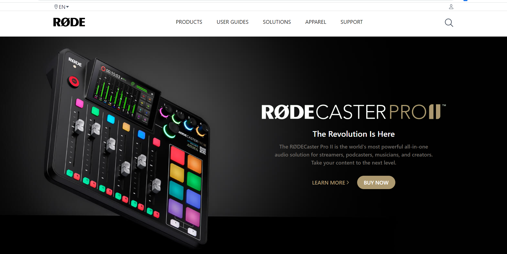
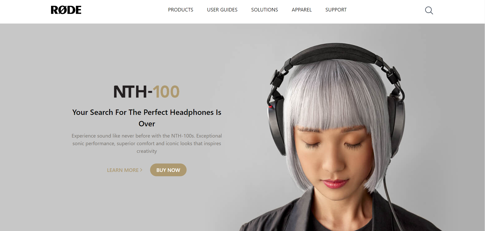
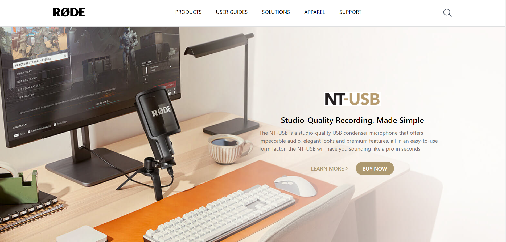
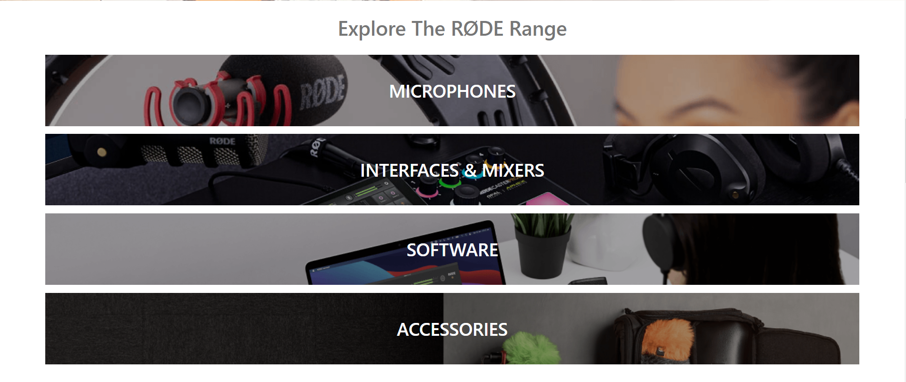
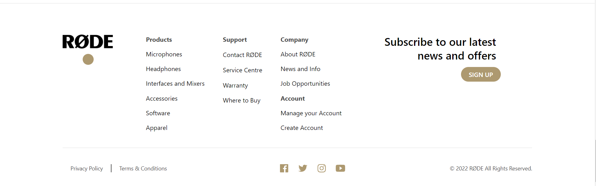
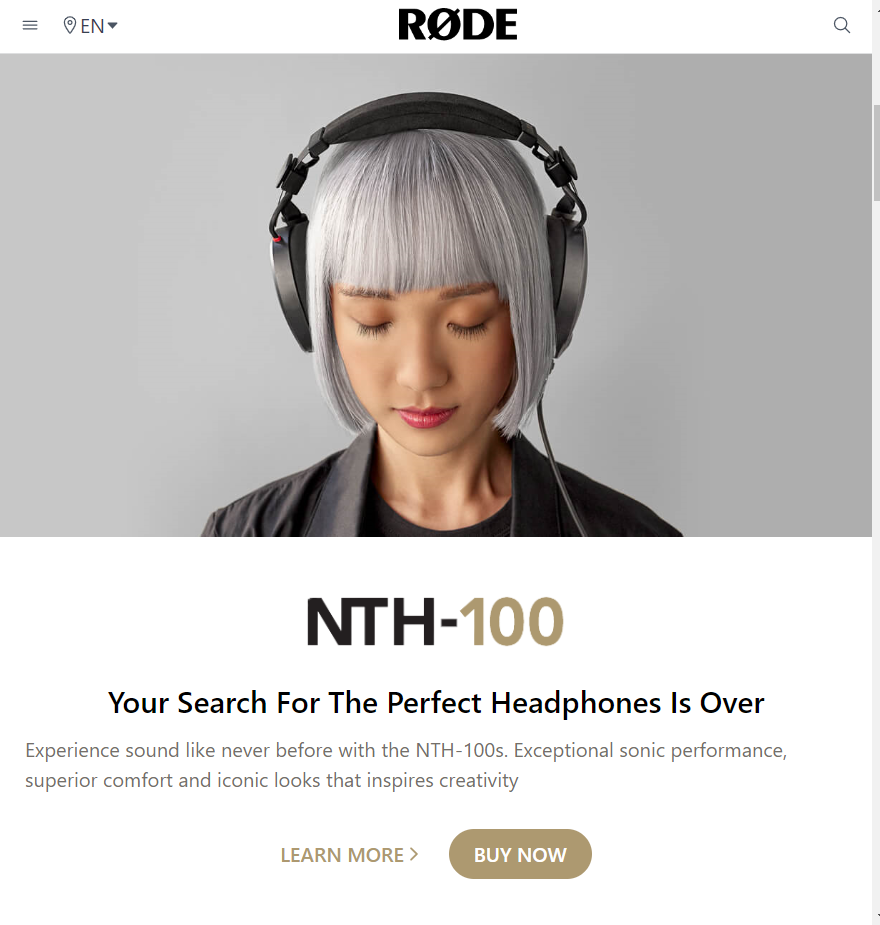

 ✨
# Rode Website Clone Using Tailwind CSS  

I created this Rode website clone. This project is fully responsive made entirely with html and tailwind css. In this project I have learned about tailwind in-depth.

## Key Learning 
- Tailwind CSS 
- Flex and Flexbox
- Mobile First Approach 
- Position 
- Responsive Design
***
# Deployment Link -    [Live Link](https://rode-website-clone-eight.vercel.app/)

# Preview 

## Desktop view
https://user-images.githubusercontent.com/111582082/197250248-762bbe05-2ff9-4259-8781-f8a20b764fe7.mp4

## Tablet View
https://user-images.githubusercontent.com/111582082/197250323-cda795a3-fed0-4cb8-9ff4-e5436669984d.mp4

## Mobile View
https://user-images.githubusercontent.com/111582082/197250392-c701e665-e35c-40bf-87a5-9345aaa72f34.mp4

***
## Technologies Used 

