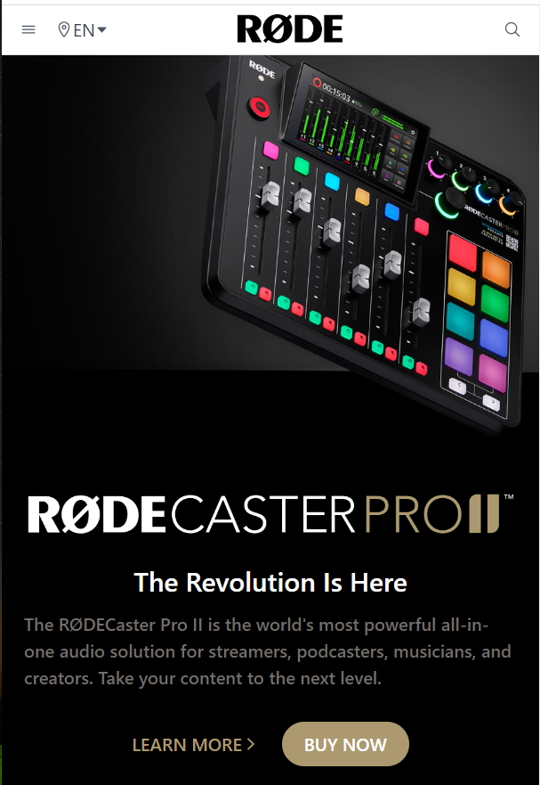

 ✨
# Rode Website Clone Using Tailwind CSS  

I created this Rode website clone and this is responsive with diffrent size of screens. This project is made entirely with html and tailwind css. In this project I have learned about tailwind in-depth.

## Key Learning 
***
- Tailwind CSS 
- Flex and Flexbox
- Mobile First Approach 
- Position 
- Responsive Design

# Deployment Link -    [Live Link](https://rode-clone-01.netlify.app/)

# Preview 
***

## Desktop view

## Tablet View

## Mobile View

## Technologies Used 
***

